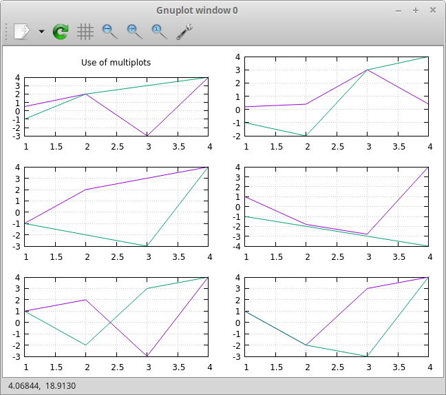

# Libraries

To see the full list of dependencies, see the `ciel.asd` project definition or this [dependencies list](dependencies.md).

To browse and find other Common Lisp libraries, please visite [awesome-cl](https://github.com/CodyReichert/awesome-cl). They are a `quickload` away.


Data formats
------------

### CSV

You have [cl-csv](https://github.com/AccelerationNet/cl-csv), under its `cl-csv` package name and the `csv` local nickname.

```lisp
;; read a file into a list of lists
(cl-csv:read-csv #P"file.csv")
=> (("1" "2" "3") ("4" "5" "6"))

;; read csv from a string (streams also supported)
(cl-csv:read-csv "1,2,3
4,5,6")
=> (("1" "2" "3") ("4" "5" "6"))

;; read a file that's tab delimited
(cl-csv:read-csv #P"file.tab" :separator #\Tab)

;; loop over a CSV for effect
(let ((sum 0))
  (cl-csv:do-csv (row #P"file.csv")
    (incf sum (parse-integer (nth 0 row))))
  sum)
```

See also:

-   [auto-text](https://github.com/defunkydrummer/auto-text), automatic detection for text files (encoding, end of line, column width, csv delimiter etc). [inquisitor](https://github.com/t-sin/inquisitor) for detection of asian and far eastern languages.
-   [CLAWK](https://github.com/sharplispers/clawk), an AWK implementation embedded into Common Lisp, to parse files line-by-line.

### JSON

We use [shasht](https://github.com/yitzchak/shasht) to read and write JSON. It has a `json` nickname.

We use [cl-json-pointer](https://github.com/y2q-actionman/cl-json-pointer/) to refer to nested keys with a short syntax. It has a `json-pointer` nickname.

#### read-json, write-json

Shasht is one of the newest and one of the best JSON handling libraries.

To encode an object to a stream (standard output, a string, or another
stream), use `write-json`. Its signature is:

```lisp
(write-json value &optional (output-stream t))
```

Example:

By default, write to standard output:

```lisp
(json:write-json (list (dict :a 1)))
;; => printed representation:
[
  {
    "A": 1
  }
]
;; => and the returned object:
(
 (dict
  :A 1
 ) )
```

Note how Shasht returns a hash-table, that is handily constructed with
our `dict` representation.

To encode an object and print to a string, use the final `output-stream` argument to `nil`:

~~~lisp
(shasht:write-json (list (dict :a 1)) nil)
;; =>
"[
  {
    \"A\": 1
  }
]"
~~~

To encode or decode objects from a stream or a string, use `read-json`:

```lisp
(let ((string "{\"foo\": [1, 2, 3], \"bar\": true, \"baz\": \"!\"}"))
  (json:read-json string))
;; =>
 (dict
  "foo" #(1 2 3)  ;; <= an array
  "bar" T
  "baz" "!"
 )
```

Note how the `[1, 2, 3]` list was formatted to a vector (`#(1 2
3)`). Shasht gives us many options as dynamic variables that influence
the parsing (see its README and below), in that case we can change
`*read-default-array-format*` to `:list`:

~~~lisp
(let ((json:*read-default-array-format* :list))
  (let ((string "{\"foo\": [1, 2, 3], \"bar\": true, \"baz\": \"!\"}"))
    (json:read-json string)))
;; =>
 (dict
  "foo" '(1 2 3)  ;; <= now a list
  "bar" T
  "baz" "!"
 )
~~~

Shasht can **encode and decode from objects**. Given a simple class:

```lisp
(defclass person ()
  ((name :initarg :name)
   (lisper :initform t)))
```

We can encode an instance of it:

```lisp
(json:write-json (make-instance 'person :name "you"))
;; =>
{
  "NAME": "you",
  "LISPER": true
}
#<PERSON {1007FDDDC3}>
```

#### JSON options

*(See its README for possible updates)*

Parsing (reading) options:

- `common-lisp:*read-default-float-format*` — Controls the floating-point format
   that is to be used when reading a floating-point number.
- `*read-default-true-value*` — The default value to return when reading a true
  token. Initially set to `t`.
- `*read-default-false-value*` — The default value to return when reading a
  false token. Initially set to `nil`.
- `*read-default-null-value*` — The default value to return when reading a null
  token. Initially set to `:null`.
- `*read-default-array-format*` — The default format to use when reading an
  array. Current supported formats are `:vector` or `:list`. Initially set to
  `:vector`.
- `*read-default-object-format*` — The default format to use when reading an
  object. Current supported formats are `:hash-table`, `:alist` or `:plist`.
  Initially set to `:hash-table`.
- `*read-length*` — The maximum number of values in an array or an object.
  Initially set to `nil` which disables length checking.
- `*read-level*` — The maximum number of levels to allow during reading for
  arrays and objects. Initially set to `nil` which disables level checking.

There is also a keyword variant `read-json*` which will set the various dynamic
variables from supplied keywords.

```lisp
(read-json* :stream nil
            :eof-error t
            :eof-value nil
            :single-value nil
            :true-value t
            :false-value nil
            :null-value :null
            :array-format :vector
            :object-format :hash-table
            :float-format 'single-float
            :length nil
            :level nil)
```

Serialization (writing) options:

- `common-lisp:*print-pretty*` — If true then a simple indentation algorithm
  will be used.
- `*write-indent-string*` — The string to use when indenting objects and arrays.
   Initially set to `#\space`.
- `*write-ascii-encoding*` — If true then any non ASCII values will be encoded
  using Unicode escape sequences. Initially set to `nil`.
- `*write-true-values*` — Values that will be written as a true token. Initially
  set to `'(t :true)`.
- `*write-false-values*` — Values that will be written as a false token.
  Initially set to `'(nil :false)`.
- `*write-null-values*` — Values that will be written as a null token. Initially
  set to `(:null)`.
- `*write-alist-as-object*` — If true then assocation lists will be written as
  an object. Initially set to `nil`.
- `*write-plist-as-object*` — If true then property lists will be written as an
  object. Initially set to `nil`.
- `*write-empty-array-values*` — A list of values that will be written as an
  empty array.
- `*write-empty-object-values*` — A list of values that will be written as an
  empty object.
- `*write-array-tags*` — A list of values whose appearance in the CAR of a list
  indicates the CDR of the list should be written as an array. Initially set to
  `'(:array)`.
- `*write-object-alist-tags*` — A list of values whose appearance in the CAR of
  a list indicates the CDR of the list is an alist and should be written as an
  object. Initially set to `'(:object-alist)`.
- `*write-object-plist-tags*` — A list of values whose appearance in the CAR of
  a list indicates the CDR of the list is a plist and should be written as an
  object. Initially set to `'(:object-plist)`.

The actual serialization of JSON data is done by the generic function
`print-json-value` which can be specialized for additional value types.

```lisp
(print-json-value value output-stream)
```

There is also a keyword variant `write-json*` which will set the various dynamic
variables from supplied keywords and will default to the current dynamic value
of each keyword.

#### JSON pointer

JSON pointers ([RFC 6901](https://www.rfc-editor.org/rfc/rfc6901)) are especially handy to manipulate nested objects. We can access, set and delete keys and values with short pointers, which are strings.

Example:

~~~lisp
(defparameter *json-data*
  "{
   \"foo\": [\"bar\", \"baz\"]
   }")

(let ((obj (json:read-json *json-data*)))
  (json-pointer:get obj "/foo/0"))
;; => "bar"
~~~

The available functions and their arguments are:

- `json-pointer:get` `(obj pointer)`
- `json-pointer:set` `(obj pointer value)`
- `json-pointer:update` `(place pointer value)`
- `json-pointer:add` `(obj pointer value)`
- `json-pointer:delete` `(obj pointer)`
- `json-pointer:deletef` `(place pointer)`
- `json-pointer:remove` `(obj pointer)`
- `json-pointer:exists-p` `(obj pointer)`

`json-pointer:get` traverses OBJ with POINTER and returns three values:

- the found value (nil if not found),
- a generalized boolean saying the existence of the place pointed by POINTER,
- and NIL.

JSON-POINTER functions actually take a dict (hash-table) as first argument.

Examples:

~~~lisp
(json-pointer:get (dict \"a\"
                     (dict \"aa\" 11))
                   \"/a/aa\")
;; => 11
~~~

Parse a JSON string with `shasht:read-json` before feeding the result to json-pointer:

~~~lisp
(defvar *json-string*  \"{\\\"foo\\\": [\\\"1\\\", \\\"2\\\"]}\")

(let ((obj (shasht:read-json *json-string*)))
   (json-pointer:get obj \"/foo\"))
;; =>
#(\"1\" \"2\")
T
NIL
~~~

A JSON pointer starts with a "/".

<!-- A note on functions naming: [cl-json-pointer](https://github.com/y2q-actionman/cl-json-pointer/) has some lengthy function names by default (`get-by-json-pointer`), especially if we access them with the `json-pointer:` prefix. They provide very short ones (`get`), they live in another package name `cl-json-pointer/synonyms`. Our `json-pointer` is a nickname to it. If you want to import all the json-pointer functions with `use-package`, you can do so with `cl-json-pointer`. We created smaller function names, which you can import without conflicts (`get-by`). -->


### YAML (not included)

Please quickload `cl-yaml` (uses libyaml) or have a look at [nyaml](https://github.com/jasom/nyaml), a Lisp native parser and dumper


## Date and time

The [local-time](https://common-lisp.net/project/local-time/) package is available.

See also [awesome-cl\#date-and-time](https://github.com/CodyReichert/awesome-cl#date-and-time) and the [Cookbook](https://lispcookbook.github.io/cl-cookbook/dates_and_times.html).

## Databases

[cl-dbi](https://github.com/fukamachi/cl-dbi/) (db independent interface) and [SxQL](https://github.com/fukamachi/sxql) (a SQL generator) are available.

Connect to a database with cl-dbi:

~~~lisp
 (defvar *connection*
  (dbi:connect :sqlite3
               :database-name "/home/user/test.sqlite3"))
~~~

`dbi` will install the required database driver on the fly.

> Attention: if you build a binary and plan to use it on another
> machine, you must add the driver as a system dependency. It is one
> of `:dbd-sqlite3`, `:dbd-mysql` or `:dbd-postgres`.

Now you can execute queries.

Either use SXQL to generate SQL from a lispy DSL:

~~~lisp
(select (:id :name )
  (from (:as :person :p))
  (where (:and (:>= :age 18)
               (:< :age 65)))
  (order-by (:desc :age)))
~~~

or use in-line SQL:

```lisp
(dbi:fetch-all
  (dbi:execute
    (dbi:prepare *connection* "select id, name from person where age < ?"
         (list max-age))))
```

If you want an ORM, see [Mito](https://github.com/fukamachi/mito/). You also have things like [cl-yesql](https://github.com/ruricolist/cl-yesql). For more choices, see https://github.com/CodyReichert/awesome-cl#database

And for a tutorial, see <https://lispcookbook.github.io/cl-cookbook/databases.html>


## Files and directories

CL has built-in functions to deal with files and directories, and UIOP (built-in) provides more.

Please refer to:

* [https://lispcookbook.github.io/cl-cookbook/files.html](https://lispcookbook.github.io/cl-cookbook/files.html)

See some functions under `uiop`, especially under `uiop/filesystem` (`filesystem` for short) like `filesystem:file-exists-p`, and some more under `uiop/os` (or just `os`) like `os:getcwd`.

Example functions (not exhaustive):

```
;; filesystem is a nickname for UIOP, that includes a few more functions.
filesystem:call-with-current-directory
filesystem:collect-sub*directories
filesystem:delete-directory-tree
filesystem:delete-empty-directory
filesystem:delete-file-if-exists
filesystem:directory*
filesystem:directory-exists-p
filesystem:directory-files
filesystem:ensure-all-directories-exist
filesystem:file-exists-p
filesystem:filter-logical-directory-results
filesystem:get-pathname-defaults
filesystem:getenv-absolute-directories
filesystem:getenv-absolute-directory
filesystem:getenv-pathname
filesystem:getenv-pathnames
filesystem:inter-directory-separator
filesystem:lisp-implementation-directory
filesystem:lisp-implementation-pathname-p
filesystem:native-namestring
filesystem:parse-native-namestring
filesystem:probe-file*
filesystem:rename-file-overwriting-target
filesystem:resolve-symlinks
filesystem:resolve-symlinks*
filesystem:safe-file-write-date
filesystem:split-native-pathnames-string
filesystem:subdirectories
filesystem:truename*
filesystem:truenamize
filesystem:with-current-directory
```

We also ship [file-finder](https://github.com/lisp-maintainers/file-finder), which is very handy to:

- search for files, recursively or not, and filter with our predicates,
  - exclude hidden linux directories and `node_modules/` by
    default. Furnish the `*exclude-directories*` variable to exclude more.
- inspect the file objects with the regular `inspect` or `describe`
  tools and see at a glance metadata such as permissions, last access
  time, etc,
- change metada: the class slots have setters that write to disk,
- manipulate paths and avoid common pitfalls from the built-in and UIOP functions.

> NB: you can use the `finder` local nickname in the `ciel-user` package.


Note that file-finder is not meant to manipulate arbitrary paths of non-existing files.
Consider using [ppath](https://github.com/fourier/ppath) instead.

Quick examples:

~~~lisp
;; List all files in the current directory, recursively:
CIEL-USER> (file-finder:finder)
(#F"~/projets/ciel/.git/" #F"~/projets/ciel/.github/" #F"~/projets/ciel/docs/" ...)

;; List all files under the src/ directory, recursively:
CIEL-USER> (file-finder:finder* :root (file-finder:file "src/"))
(#F"~/projets/ciel/src/ciel.fasl" #F"~/projets/ciel/src/ciel.lisp"
 #F"~/projets/ciel/src/cl-cron.log" #F"~/projets/ciel/src/test-5am.lisp"
 #F"~/projets/ciel/src/utils.lisp")

;; List all files with a lisp extension, still recursively:
CIEL-USER> (file-finder:finder (file-finder:extension= "lisp"))
(#F"~/projets/ciel/src/ciel.lisp" …)

;; List all files containing a string on their path (full pathname):
CIEL-USER> (file-finder:finder "foo")
…

;; List all files whose filename fully matches, case insensitive:
CIEL-USER> (file-finder:finder (file-finder:iname= "ciel"))
…

;; Get the filenames as strings, not #F objects:
CIEL-USER> (mapcar #'path *)
…

;; Create file objects and inspect their attributes:
CIEL-USER> (file-finder:file "ciel.asd")
#F"~/projets/ciel/ciel.asd"

CIEL-USER> (inspect *)

The object is a STANDARD-OBJECT of type FILE-FINDER/FILE:FILE.
0. PATH: "/home/vince/projets/ciel/ciel.asd"
1. INODE: 5287804
2. LINK-COUNT: 1
3. KIND: :REGULAR-FILE
4. SIZE: 3135
5. DISK-USAGE: 12288
6. CREATION-DATE: @2021-08-10T14:39:36.000000+02:00
7. MODIFICATION-DATE: @2021-08-10T14:39:36.000000+02:00
8. ACCESS-DATE: @2021-08-10T14:47:24.000000+02:00
>
~~~

And there is more, check file-finder's documentation.

> WARN: file-finder is still experimental.


## GUI (tk) (removed)

Previous versions of CIEL shipped [nodgui](https://lispcookbook.github.io/cl-cookbook/gui.html#tk-ltk-and-nodgui) which, in its default form, is featureful but heavy in dependencies for us.

As of August of 2024, a lightweight [`nodgui-lite` system was made available](https://www.autistici.org/interzona/nodgui.html#nodgui-lite).

It is not yet included in CIEL.

We leave nonetheless the presentation of the library.

The Tk toolkit is nearly ubiquitous and simple to use. It doesn't have a great deal of widgets, but it helps anyways for many kind of uses, from utility GUIs to industrial applications. Moreover, it doesn't look aweful (as it did decades ago), it has themes to look surprisingly good on the different platforms.

nodgui is a fork of Ltk, with a built-in theme and more widget.

Here's how nodgui looks in CIEL, with the Yaru them loaded by default:


Here's how it can look on Mac:


You have other GUI options a quickload away (Gtk, Qt4, IUP, not mentioning LispWorks CAPI…): <https://lispcookbook.github.io/cl-cookbook/gui.html>

Here's how to start with nodgui:

-   either put yourself in the `nodgui-user` package:

```lisp
(in-package :nodgui-user)
```

-   either `use` nodgui:

```lisp
(use-package :nodgui)
```

Use the `with-nodgui` macro to define your GUI, use `make-instance` + a widget name to create it, and use the `grid` to position widgets.

```lisp
(with-nodgui ()
  (let ((button (make-instance 'button :text "hello")))
    (grid button 0 0)))
```

Read more: <https://lispcookbook.github.io/cl-cookbook/gui.html#tk>


## Numerical and scientific

We import `mean`, `variance`, `median` and `clamp` from Alexandria.

We import functions to parse numbers (Common Lisp only has `parse-integer` by default).

[parse-float](https://github.com/soemraws/parse-float)

Similar to PARSE-INTEGER, but parses a floating point value and returns the value as the specified TYPE (by default `*READ-DEFAULT-FLOAT-FORMAT*`). The DECIMAL-CHARACTER (by default \#.) specifies the separator between the integer and decimal parts, and the EXPONENT-CHARACTER (by default \#e, case insensitive) specifies the character before the exponent. Note that the exponent is only parsed if RADIX is 10.

``` text
ARGLIST: (string &key (start 0) (end (length string)) (radix 10) (junk-allowed nil)
        (decimal-character .) (exponent-character e)
        (type *read-default-float-format*))
```

From [parse-number](https://github.com/sharplispers/parse-number), we import:

``` text
:parse-number
:parse-positive-real-number
:parse-real-number
```

``` text
PARSE-NUMBER
  FUNCTION: Given a string, and start, end, and radix parameters,
  produce a number according to the syntax definitions in the Common
  Lisp Hyperspec.
  ARGLIST: (string &key (start 0) (end nil) (radix 10)
          ((float-format *read-default-float-format*)
           *read-default-float-format*))
```

See also [cl-decimals](https://github.com/tlikonen/cl-decimals) to parse and format decimal numbers.

We don't ship *Numcl*, a Numpy clone in Common Lisp, but we invite you to install it right now with Quicklisp:

```lisp
(ql:quickload "numcl")
```

### Plotting

We import the [vgplot](https://github.com/volkers/vgplot) plotting library, an interface to `gnuplot`.

It has a very good demo: just call

    (vgplot:demo)



Here's a simple example to create a new plot:

~~~lisp
 (vgplot:plot #(1 2 3) #(0 -2 -17) "silly example")
 (vgplot:title "Simple curve")
 (vgplot:text 1.2 -14 "Plot vectors with legend and add a title")
~~~

This will open a gnuplot window, which you can interfere with by
entering more vgplot commands.

`format-plot` allows direct commands to the running gnuplot process:

~~~lisp
(vgplot:format-plot t "set size square 0.5,0.5~%")
(vgplot:replot)
~~~

You can open other plots in parallel with `new-plot`, and create subplots in the same window with `subplot`.

You can graph data from files:

~~~lisp
(vgplot:plot (first (vgplot:load-data-file "data.csv")))
~~~

Close plots with `close-plot` or `close-all-plots`.

Explore the demo [here](https://github.com/volkers/vgplot/blob/master/demo.lisp).


## Operating System

`UIOP`, as always, has some useful functions. This time, they are
under `uiop/os` (or simply `uiop`). We added a local nickname:
`os`. You will find:

```
os:*implementation-type*
os:architecture
os:chdir
os:detect-os
os:featurep
os:getcwd
os:getenv
os:getenvp
os:hostname
os:implementation-identifier
os:implementation-type
os:lisp-version-string
os:operating-system
os:os-cond
os:os-genera-p
os:os-macosx-p
os:os-unix-p
os:os-windows-p
os:parse-file-location-info
os:parse-windows-shortcut
os:read-little-endian
os:read-null-terminated-string
```


~~~lisp
;; read an environment variable:
CIEL> (os:getenv "USER")
"vindarel"

;; get the current working directory:
CIEL> (os:getcwd)
#P"/home/vindarel/projects/ciel/"

CIEL> (os:detect-os)
:OS-UNIX
~~~


But typing `os:` and TAB in SLIME doesn't help very much with
auto-discovery, so we also added a `/os` local nickname, so that we
see the available symbols earlier in the autocompletion list.

We include [file-notify](https://github.com/shinmera/file-notify) to watch changes to files (using `inotify` on Linux and `fsevent` on MacOS). It is available with the `notify:` local nickname.

~~~lisp
  (notify:watch "webapp.lisp")
    (notify:with-events (file change :timeout T)
      ;; Print the available list of events:
      ;; (print (list file change))
      (when (equal change :close-write)
        (format! t "~%~%Reloading ~a…~&" file)
        (handler-case
            (ciel::load-without-shebang "webapp.lisp")
          (reader-error ()
            ;; Catch some READ errors, such as parenthesis not closed, etc.
            (format! t "~%~%read error, waiting for change…~&"))))))
~~~


## Security

We ship [secret-values](https://github.com/rotatef/secret-values) that
helps in reducing the risk of accidentally revealing secret values,
such as passwords.

When you read a password, you can hide it behind a `secret-values` object:

```lisp
(secret-values:conceal-value "secret")
;; => #<SECRET-VALUES:SECRET-VALUE {100F2EC9E3}>
```

To reveal it, at the last moment, use:

```lisp
(secret-value:reveal-value *)
;; => "secret"
```

See also what `ensure-value-revealed` does on their documentation.


## Threads, monitoring, scheduling

We ship:

[Bordeaux-Threads](https://common-lisp.net/project/bordeaux-threads/) (`bt` prefix)

[Lparallel](https://lparallel.org/)

<!-- currently removed: <2023-11-18 Sat> see .asd -->
<!-- [Moira](https://github.com/ruricolist/moira) (monitor and restart background threads) -->

[trivial-monitored-thread](http://quickdocs.org/trivial-monitored-thread/)

> Trivial Monitored Thread offers a very simple (aka trivial) way of spawning threads and being informed when one any of them crash and die.

[cl-cron](http://quickdocs.org/cl-cron/api) (see the sources on [our fork here](https://github.com/ciel-lang/cl-cron))

For example, run a function every minute:

```lisp
(defun say-hi ()
  (print "Hi!"))
(cl-cron:make-cron-job #'say-hi)
(cl-cron:start-cron)
```

Wait a minute to see some output.

Stop all jobs with `stop-cron`.

`make-cron`'s keyword arguments are:

```lisp
(minute :every) (step-min 1) (hour :every) (step-hour 1) (day-of-month :every)
(step-dom 1) (month :every) (step-month 1) (day-of-week :every)
(step-dow 1)
(boot-only nil) (hash-key nil))
```

## HTTP and URI handling

See:

-   Dexador. Use the `dex` nickname or the `http` local nickname.
-   Quri
-   Lquery

```lisp
(dex:get "http://my.url")
```

## Web

We ship:

-   Hunchentoot (web server)
-   Easy-routes (route facility and middleware)

<https://web-apps-in-lisp.github.io/>

More over, see our `simpleHTTPserver` script, built-in, to serve a local directory:

    $ ciel -s simpleHTTPserver
    Serving files on port 9000…
    ⤷ http://127.0.0.1:9000

*(the script name is case insensitive)*


## Networking

We ship:

- [cl-ftp](https://github.com/pinterface/cl-ftp). This is a typical Lisp library that looks abandoned, but just works©.

It is available under the `ftp` package name. Here's a quick snippet:

```lisp
(ftp:with-ftp-connection (conn :hostname (get-hostname)
                               :username (get-ftp-username)
                               :password (get-password)
                               :passive-ftp-p t)
      (ftp:store-file conn in-filename out-filanem))
```

and that's it!

To connect to an SFTP server or to another protocol, have a look at our [lftp-wrapper](https://github.com/vindarel/lftp-wrapper). Or simply default out to shell commands with `uiop:run-command` or `cmd:cmd`.


## Other utilities

### Progress bar

We ship [progressons](https://github.com/vindarel/progressons), a simple progress bar.

You can use it inside your editor, including Emacs and Slime, as well as on the terminal.

Example usage:

```lisp
(loop for elt in (progressons:progressbar (list 1 2 3 4 5))
   do (do-something-with elt)
      (sleep 0.1)
      (progressons:step!))
```

As you can see, it needs a manual `step!` to make it progress.

> WARN: progressons in its present form adds significant overhead. You shouldn't use it with a large dataset.

Use [termp](https://github.com/vindarel/termp) if you want to check
wether you are inside a dumb terminal, like Slime's REPL, or a real
one. This check is done by looking at the `TERM` environment variable.

## Development


### Testing (Fiveam)

The [FiveAM](https://common-lisp.net/project/fiveam/docs/) test framework is available for use.

CIEL defines a package `ciel-5am-user` that also "uses" all Fiveam symbols, in addition of all others.

It's best to define your own test package for your application (see
below), but you can start with this one.

Here's how we define a very simple test:

```lisp
(in-package :ciel-5am-user)

(test test-one
  (is (= 1 1)))
```

Run the test with:

``` txt
(run! 'test-one)

Running test TEST-ONE .
 Did 1 check.
    Pass: 1 (100%)
    Skip: 0 ( 0%)
    Fail: 0 ( 0%)

T
NIL
NIL
```

If the test fails you will see explanations:

``` txt
> (run! 'test-one)

Running test TEST-ONE .f
 Did 2 checks.
    Pass: 1 (50%)
    Skip: 0 ( 0%)
    Fail: 1 (50%)

 Failure Details:
 --------------------------------
 TEST-ONE []:

1

 evaluated to

1

 which is not

=

 to

2


 --------------------------------

NIL
(#<IT.BESE.FIVEAM::TEST-FAILURE {1007307ED3}>)
NIL
```

Use `run` to not print explanations.

You can use `(!)` to re-run the last run test.

#### Interactive debugger on errors

You can ask 5am to open the interactive debugger on an error:

``` example
(setf *debug-on-error* t)
```

#### Define your own test package, add local-nicknames

Using only this built-in `ciel-5am-user` package won't be practical if
you develop different applications at the same time in the same Lisp
image. Just define a new package:

```lisp
(uiop:define-package myproject-tests
   (:use :cl :ciel :5am))
```

This "uses" all CL, CIEL and Fiveam symbols.

If you want all the local nicknames that are available in the CIEL
package, copy the list below:

~~~lisp
(uiop:define-package myproject
    (:use :cl :ciel)
    (:local-nicknames (:/os :uiop/os)
                      (:os :uiop/os)
                      (:filesystem :uiop/filesystem)
                      (:finder :file-finder)
                      (:notify :org.shirakumo.file-notify)
                      (:alex :alexandria)
                      (:csv :cl-csv)
                      (:http :dexador)
                      (:json :shasht)
                      (:json-pointer :cl-json-pointer/synonyms)
                      (:time :local-time)
                      (:routes :easy-routes))
    (:documentation "My package, using CIEL and defining the same local nicknames."))
~~~


### Logging (log4cl)

<https://github.com/sharplispers/log4cl/>

``` example
(log:info …)
```

### Discoverability of documentation (repl-utilities' readme, summary,…)

We make [repl-utilities](http://quickdocs.org/repl-utilities/) available, which provides `readme` and `summary`:

Learn more with:

``` example
(repl-utilities:readme repl-utilities)
```

### printv

[printv](https://github.com/danlentz/printv)

```lisp
 (:printv
  (defvar *y*)
  (defparameter *x* 2)
  (setf *y* (sqrt *x*))
  (setf *y* (/ 1 *y*)))

;; This produces the following text to PRINTV's output stream, and still results in the same returned value: 0.70710677.

;;;   (DEFVAR *Y*) => *Y*
;;;   (DEFPARAMETER *X* 2) => *X*
;;;   (SETF *Y* (SQRT *X*)) => 1.4142135
;;;   (SETF *Y* (/ 1 *Y*)) => 0.70710677

```

### Getting a function's arguments list (trivial-arguments)

<https://github.com/Shinmera/trivial-arguments>

```lisp
(defun foo (a b c &optional d) nil)
(arglist #'foo)
;; (a b c &optional d)
```

### Searching for libraries on GitHub, Quickdocs and Cliki (quicksearch)

We include
[Quicksearch](https://github.com/lisp-maintainers/quicksearch), a
simple search utility for Common Lisp libraries that searches on
GitHub, Quickdocs and Cliki.

You can call it with CIEL's binary:

    $ ciel -s quicksearch ciel

or by calling its wrapper script directly:

    $ quicksearch.lisp ciel  # according you have it in your PATH

or from the Lisp REPL:

    (qs:? "ciel" :u)

this will search for the "ciel" keyword and it will print the URL of
search results (`:u`).

```
SEARCH-RESULTS: "ciel"
======================

 Cliki
 -----
  cl-cron
      http://www.cliki.net/cl-cron

 GitHub
 ------
  CIEL
      https://github.com/ciel-lang/CIEL
  cl-cron
      https://github.com/lisp-mirror/cl-cron
```
